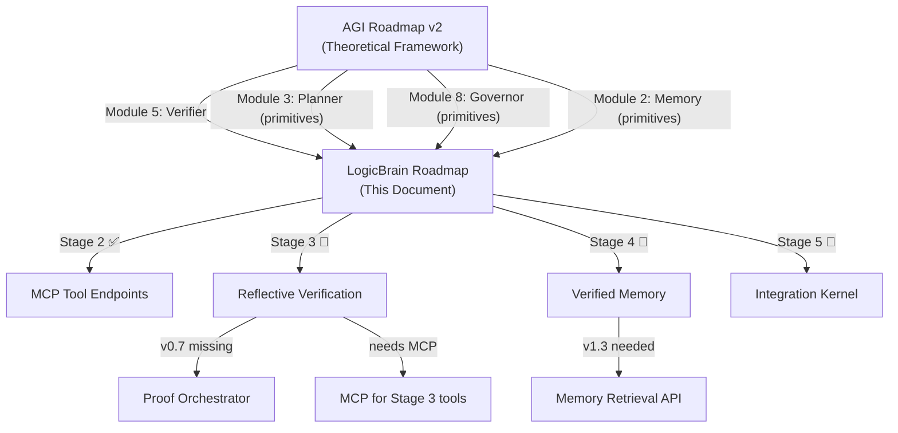

# LogicBrain Development Roadmap

**Anchored to:** [agi_roadmap_v2.md](file:///d:/AgenticAI/LogicBrain/docs/agi_roadmap_v2.md)
**Date:** 2026-03-20 · **Status:** Living document

---

## Purpose

This document is the **single actionable roadmap** for LogicBrain development.
It maps every LogicBrain milestone to the 5-stage AGI architecture defined in
`agi_roadmap_v2.md`, making visible *why* each module exists and *which AGI
capability* it enables.

### Guiding Principle

> LogicBrain is the **Verifier module** of a cognitive architecture.
> Its job is to provide formal guarantees — soundness, consistency,
> policy compliance, and proof certificates — that no LLM can provide
> alone. Every version must strengthen this role.

---

## Architecture Mapping

```
AGI Stage           LogicBrain Role              Versions
─────────────────────────────────────────────────────────────
Stage 1: Language   (not applicable)             —
Stage 2: Tool       MCP tool endpoints           v0.2.0 ✅
Stage 3: Reflective Verification + Contracts     v0.3–v0.7
Stage 4: Learning   Verified Memory + Exchange   v0.8–v1.2
Stage 5: Cognitive  Integration Kernel contrib.   v1.5+
```

---

## Current State (v0.2.0) — Stage 2: Tool Agent ✅

LogicBrain is a **working MCP tool** that any Stage 2 agent can use.

| Capability | Module | Status |
|------------|--------|--------|
| Propositional logic verification | `PropositionalVerifier` | ✅ Stable |
| First-order logic verification | `PredicateVerifier` | ✅ Stable |
| Incremental Z3 sessions | `Z3Session` | ✅ Stable |
| Lean 4 theorem proving | `LeanSession` | ✅ Stable |
| MCP server (6 tools) | `mcp_server.py`, `mcp_tools.py` | ✅ Stable |
| API stability contract | `STABILITY.md` | ✅ Published |
| Structured diagnostics | `Diagnostic` | ✅ Stable |

**What Stage 2 enables:** An agent can call LogicBrain as a tool to
verify claims, check satisfiability, and receive diagnostics. The agent
cannot yet reason *about* its own reasoning — that's Stage 3.

---

## Stage 3: Reflective Agent (v0.3 – v0.7)

> **Goal:** Transform LogicBrain from reactive verifier to proactive
> reasoning infrastructure — tools the agent uses *during* thinking.

### Version Overview

| Version | Module | AGI Capability | Status |
|---------|--------|----------------|--------|
| **v0.3** | `ProofCertificate` | Verified outputs — prove you're not hallucinating | ✅ Implemented |
| **v0.4** | `GoalContract` | Reasoning contracts — pre/postconditions on steps | ✅ Implemented |
| **v0.5** | `BeliefGraph` | Self-consistency — detect contradictions in beliefs | ✅ Implemented |
| **v0.6** | `ActionPolicyEngine` | Policy enforcement — prune actions before execution | ✅ Implemented |
| **v0.7** | Proof Orchestrator | Compositional proofs — decompose and compose claims | ⬜ Not started |

### What's Done

The core Stage 3 modules exist and are tested:

- **`certificate.py`** — `ProofCertificate` with JSON serialization, `certify()`, `verify_certificate()`
- **`goal_contract.py`** — Machine-checkable pre/postconditions for reasoning steps
- **`belief_graph.py`** — Contradiction detection with Z3-backed consistency checks
- **`action_policy.py`** — Boolean policy engine with Z3 consistency and subsumption

### What's Missing for Stage 3 Completion

| Gap | What's Needed | Priority |
|-----|---------------|----------|
| Proof orchestration (v0.7) | `ProofOrchestrator` — decompose complex claims, verify sub-claims, compose certificates | 🔴 High |
| MCP exposure of Stage 3 tools | Expose `certify`, `check_beliefs`, `check_contract` as MCP tools | 🔴 High |
| Agent workflow examples | Real-world examples showing reflective verification loops | 🟡 Medium |
| Acceptance criteria validation | Run Stage 3 criteria from [agi_roadmap_v2.md §4.3](file:///d:/AgenticAI/LogicBrain/docs/agi_roadmap_v2.md) against LogicBrain-assisted agent | 🟡 Medium |

---

## Stage 4: Learning Agent (v0.8 – v1.2)

> **Goal:** Enable verified learning — an agent that remembers *proven*
> conclusions and exchanges proofs across boundaries.

### Version Overview

| Version | Module | AGI Capability | Status |
|---------|--------|----------------|--------|
| **v0.8** | `AssumptionSet` | Typed epistemic state (fact / assumption / hypothesis) | ✅ Implemented |
| **v0.9** | `CounterfactualPlanner` | Branch-aware planning with Z3 push/pop | ✅ Implemented |
| **v1.0** | `ActionPolicyEngine` v2 | Hard pre-action enforcement with violation evidence | ✅ Implemented |
| **v1.1** | `UncertaintyCalibrator` | Typed confidence + mandatory escalation hooks | ✅ Implemented |
| **v1.2** | `ProofExchangeNode` | Multi-agent proof bundles with schema versioning | ✅ Implemented |

### Critical Caveat (from Consensus Review)

> These modules are **primitives toward verified memory**, not a full
> learning system. A true Stage 4 Learning Agent requires:
> - Selective retrieval with relevance weighting (not just storage)
> - Forgetting policies (not just accumulation)
> - Cross-task transfer of strategies (not just proofs)
>
> LogicBrain provides the *verification substrate* — the guarantee that
> stored knowledge is sound. The retrieval, weighting, and transfer
> logic belongs in the agent, not in LogicBrain.

### What's Missing for Stage 4 Contribution

| Gap | What's Needed | Priority |
|-----|---------------|----------|
| Verified memory retrieval API | Expose proof certificates as queryable memory with relevance metadata | 🔴 High |
| Schema migration tooling | `ProofExchangeNode` schema versioning + migration for long-lived stores | 🟡 Medium |
| Cross-agent integration test | End-to-end: Agent A produces proofs, Agent B verifies and reuses | 🟡 Medium |
| Verifier-Learner interface spec | Document exactly what Z3 can/cannot check about learned knowledge (per [§5.7](file:///d:/AgenticAI/LogicBrain/docs/agi_roadmap_v2.md)) | 🟢 Done in v2 |

---

## Stage 5: General Cognitive Agent (v1.5+)

> **Goal:** Contribute to the Integration Kernel — the coordination
> layer that binds all modules of a cognitive architecture.

This stage is **research-grade** and depends on breakthroughs outside
LogicBrain's scope. However, LogicBrain can prepare specific primitives:

| Contribution | Description | Dependency |
|-------------|-------------|------------|
| **Meta-verification** | Can Z3 verify properties of the integration kernel itself? (e.g., "no action executes without Governor approval") | Requires formal model of kernel |
| **Neuro-symbolic bridge** | State encoder that maps LLM outputs to Z3-compatible symbolic variables | Requires embedding alignment research |
| **Governor-grade policy enforcement** | Extend `ActionPolicyEngine` to constrain not just actions but learning/goal-setting processes | Requires Governor architecture design |
| **Compositional certificates at scale** | Proof orchestration across 100+ sub-claims with partial verification | Requires v0.7 foundation |

### Not Planned (and Why)

| Feature | Reason |
|---------|--------|
| World model implementation | Agent's responsibility; LogicBrain verifies, doesn't simulate |
| Foundation model training | Out of scope — LogicBrain is model-agnostic |
| Embodiment / robotics | Explicitly scoped out (see agi_roadmap_v2.md §1) |
| Full episodic memory system | Agent's responsibility; LogicBrain provides verified storage primitives |
| MCTS / tree search | Agent strategy; LogicBrain prunes via policies, doesn't search |

---

## Consolidated Next Steps (Priority Order)

Based on what's implemented vs. what's missing:

| # | Action | Version | Stage | Effort |
|---|--------|---------|-------|--------|
| 1 | **Build Proof Orchestrator** (v0.7) — last missing Stage 3 module | v0.7 | 3 | ~2 weeks |
| 2 | **Expose Stage 3 modules via MCP** — `certify`, `check_beliefs`, `check_contract` as MCP tools | v0.7+ | 3 | ~1 week |
| 3 | **Verified memory retrieval API** — query proof certificates by claim/source/date | v1.3 | 4 | ~2 weeks |
| 4 | **Cross-agent proof exchange E2E test** — Agent A → proof bundle → Agent B verification | v1.3 | 4 | ~1 week |
| 5 | **Meta-verification prototype** — Z3 model of a simple integration kernel, verify safety property | v1.5 | 5 | Research |

---

## How This Connects to `agi_roadmap_v2.md`



---

## References

| Document | Role |
|----------|------|
| [agi_roadmap_v2.md](file:///d:/AgenticAI/LogicBrain/docs/agi_roadmap_v2.md) | Theoretical framework (AGI stages + modular architecture) |
| [roadmap_v013_v020.md](file:///d:/AgenticAI/LogicBrain/docs/roadmap_v013_v020.md) | Historical — API stabilization (completed) |
| [roadmap_v030_v070.md](file:///d:/AgenticAI/LogicBrain/docs/roadmap_v030_v070.md) | Detailed specs for v0.3–v0.7 modules |
| [roadmap_v080_v120.md](file:///d:/AgenticAI/LogicBrain/docs/roadmap_v080_v120.md) | Detailed specs for v0.8–v1.2 modules |
| [STABILITY.md](file:///d:/AgenticAI/LogicBrain/STABILITY.md) | API stability contract |
| [formal_guarantees.md](file:///d:/AgenticAI/LogicBrain/docs/formal_guarantees.md) | Soundness/completeness properties |
